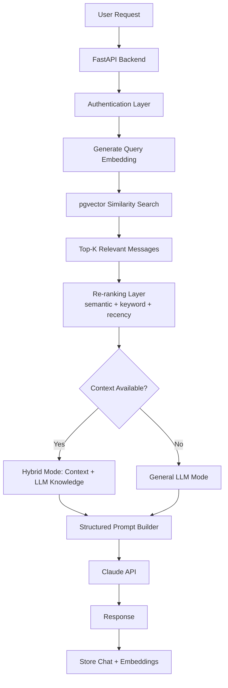

# AI Chat Backend with RAG + Hybrid Retrieval

### A FastAPI-based backend that combines semantic search, vector similarity (pgvector), and hybrid retrieval logic to generate context-aware LLM responses.

---

## Why I Built This

Built this to understand RAG systems end-to-end — especially where the pure vector similarity fails and how retrieval quality can be improved with better ranking and system design.

---

## Architecture Overview



---

## Tech Stack (with reasoning)

**FastAPI**
Chosen for async support, performance, and clean API design. More suitable than Django for a lightweight service and more structured than Flask.

**PostgreSQL + pgvector**
Allows storing relational data and embeddings in the same database. Avoids the overhead of maintaining a separate vector database like Pinecone or Chroma.

**Voyage AI (Embeddings)**
Used for strong semantic embeddings with consistent quality and simple integration. Chosen over alternatives for reliable embedding performance during experimentation.

**Claude (LLM)**
Provides strong reasoning capabilities and works well with structured prompts.

**Argon2 (Password Hashing)**
More resistant to GPU-based attacks compared to bcrypt, making it a better default for secure systems.

**SQLAlchemy**
Provides flexibility and clean ORM abstraction for database interactions.

---

## Features

- User creation with secure password hashing
- Persistent chat history stored in PostgreSQL
- Embedding generation and storage per message
- Semantic retrieval using pgvector similarity search
- Hybrid re-ranking:
  - Cosine similarity
  - Keyword overlap
  - Recency weighting
- Structured prompt design for better reasoning
- Hybrid response system:
  - Uses retrieved context when relevant
  - Falls back to general LLM knowledge when not
- Retry handling for LLM API failures
- Modular architecture (routes, services, utils separation)

---

## System Requirements

- Python 3.10+
- PostgreSQL 14+
- Docker (optional for pgvector setup)

---

## Setup Instructions

**1. Clone the repo**
```bash
git clone <your-repo-url>
cd <repo-name>
```

**2. Create virtual environment**
```bash
python -m venv venv
source venv/bin/activate   # Windows: venv\Scripts\activate
```

**3. Install dependencies**
```bash
pip install -r requirements.txt
```

**4. Setup environment variables**

Create a `.env` file:
```
DATABASE_URL=
VOYAGE_API_KEY=
CLAUDE_API_KEY=
JWT_SECRET=
```

**5. Start PostgreSQL with pgvector**
```bash
docker run -d \
  --name pgvector-db \
  -e POSTGRES_USER=postgres \
  -e POSTGRES_PASSWORD=postgres \
  -e POSTGRES_DB=ai_backend_db \
  -p 5433:5432 \
  ankane/pgvector
```

**6. Run the server**
```bash
uvicorn main:app --reload
```

---

## API Endpoints

| Method | Endpoint | Description | Auth |
|--------|----------|-------------|------|
| POST | `/users/register` | Create user | No |
| POST | `/users/login` | User login | No |
| GET | `/` | Health check | No |
| POST | `/chat/` | Send message + get response | Required |
| GET | `/chat/history` | Get chat history of current user | Required |
| DELETE | `/chat/history` | Delete history of current user | Required |

---

## How Hybrid Retrieval Works

The system first retrieves candidate messages using vector similarity via pgvector. These candidates are then re-ranked using a hybrid scoring approach combining semantic similarity, keyword overlap, and recency.

If relevant context exists, the system builds a structured prompt combining retrieved context and general knowledge. If no useful context is found, it falls back to a general LLM response to avoid injecting irrelevant information.

This improves both response quality and robustness compared to pure RAG systems.

---
 
## Key Engineering Challenges
 
**RAG Retrieval Quality**
Cosine similarity alone returned semantically similar but contextually irrelevant results. Pure vector search doesn't capture relevance — it captures similarity. Fixed by introducing hybrid re-ranking combining semantic score, keyword overlap, and recency weighting.
 
**Context Ordering in LLM Responses**
Older retrieved messages were conflicting with newer ones, causing inconsistent responses. RAG retrieval is unordered by default — LLMs are sensitive to the order context is presented. Fixed by adding recency scoring and structuring the prompt to separate historical context from recent messages.
 
**Cold Start / Empty Context**
The system failed on first query when no chat history existed — the RAG pipeline expected context that wasn't there. Fixed by introducing a fallback to general LLM mode when retrieval returns no meaningful context, making the system handle zero-history gracefully.
 
**Embedding Dimension Mismatch**
Runtime errors during similarity search caused by a mismatch between the embedding model's output dimensions and the pgvector schema definition. Fixed by verifying model output size and updating the schema to `Vector(1024)`. Vector databases require strict dimensional consistency — there's no runtime coercion.
 
---

## Known Limitations / Future Improvements

- No ANN index (ivfflat / HNSW) for large-scale retrieval
- No caching layer for embeddings or responses
- No rate limiting (API abuse protection)
- Limited observability (logging / metrics)
- No async processing for LLM calls
- No frontend / UI
